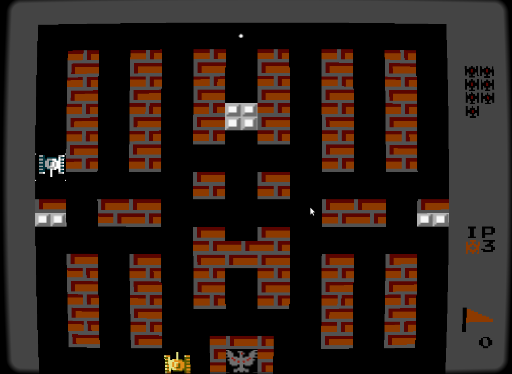

# Game Specification

We describe a simple 2D networked multiplayer game.

We have a top-down view of the world, players are tanks or similar vehicles, they have health and can shoot projectiles.

There are obstacles on the map, some of them are destroyable, others not.

At first, there is one gamemode, where all players join a lobby, the game starts when all players are ready.
In the match, players shoot each other until the last one survives, who is the winner.

The players have health (shown in a healthbar).

Maps are predefined, stored in files like explained in the metroidvania specification example.

For references:

- Nier Automata's Hacking Minigame
- ...

It could also look like this at the end:

## Goals (11 Points)

- (2) Overworld with 2 different sections:
    - Each with its own tone (architecture, sprites, music, enemies, …)
    - The second is only accessible after some story progress
    - Player can roam the world and interact with other entities
- (1) Characters
    - Player can talk to other characters
- (1) Resources
    - Player can manage acquired resources through dedicated menus
- (1) Stats
    - Player's combatants have stats that influence the combat
    - Player's combatants get experience from combat, increasing their stats
    - Stats are influenced by equipment
- (3) Combat
    - Turn-based
    - Player selects which attacks, spells, items, etc. to use on which target
    - Enemies use attacks, spells, items, etc. to combat the player
    - *Game Over* when all of player's combatants are dead
- (1) Save points
    - Player can save her progress at specific points in the game
    - Saved progress is persistent across play sessions (application termination)
- (1) Audio
    - Background music
    - Sound effects
- (1) Main menu
    - New game
    - Load game
    - Exit
